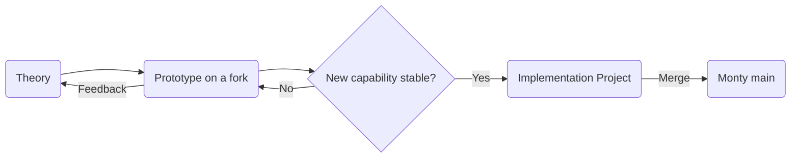
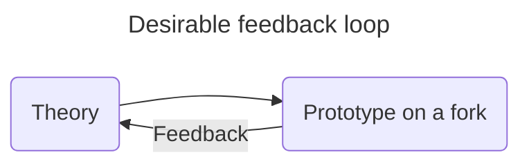
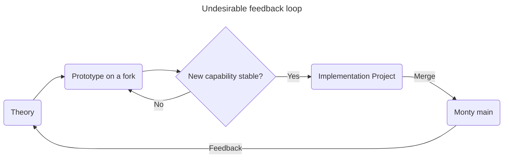
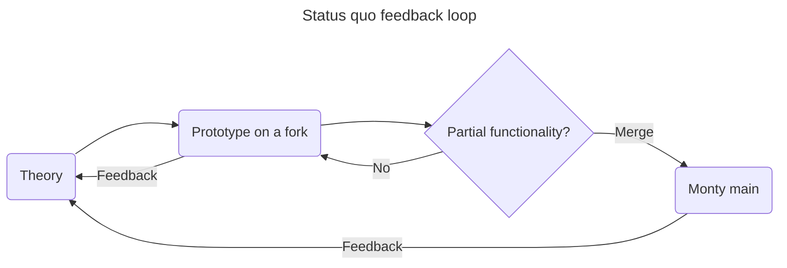

- Start Date: 2025-07-28
- RFC PR: https://github.com/thousandbrainsproject/tbp.monty/pull/405

# Conducting Research While Building a Stable Platform

[The vision of the Thousand Brains Project is to develop a platform for building AI and robotics applications using the same principles as the human brain.](https://thousandbrainsproject.readme.io/docs/vision-of-the-thousand-brains-project) To achieve this vision, we pursue the platform work while we continue to conduct active research with [open questions still to be answered](https://thousandbrainsproject.readme.io/docs/open-questions) and already [planned future work](https://thousandbrainsproject.readme.io/docs/project-roadmap).

We believe that the research and the platform are essential to our vision. We want to succeed at both.

## Inherent challenge

There lies an inherent challenge to achieving our vision. From the perspective of supply and demand competition in the marketplace, the activities of research and platform building differ in their characteristics. Some of what makes for good research directly conflicts with what makes for a good platform, and vice versa.

The below characteristics and properties are intended to contrast the state of our Research, as well as the Platform today and in the future. These are not precisely defined concepts, but intended more as a general guide to consider various aspects and conceptualize the differences. If one or two of these seems confusing, they can be skipped in favor of all the other ones. They are drawn from [the four stages of evolution as described in Wardley Mapping](https://help.mapkeep.com/microdoctrine/understand-what-is-being-considered/understand-evolution#detailed-description).

| Characteristic / Property | Research | Platform (today) | Platform (future) |
|---|---|---|---|
| _Ubiquity_ | rare / slowly increasing consumption | rare / slowly increasing consumption | rapidly increasing consumption / widespread and stabilizing |
| _Certainty_ | poorly understood / rapid increases in learning | poorly understood / rapid increases in learning | rapid increases in use / fit for purpose / commonly understood |
| _Writings about_ | describe the wonder of TBT / focus on building, constructing, awareness, and learning | focus on building, constructing, awareness, and learning | maintenance / operation / installation / features / focus on  use |
| _Market_ | undefined market | undefined / forming market | growing / mature market |
| _Knowledge management_ | uncertain / learning on use | learning on use / operation | learning on operation / known / accepted |
| _Market perception_ | chaotic / domain of experts | chaotic / domain of experts | increasing expectation of use / ordered / trivial |
| _User perception_ | different / confusing / exciting / surprising / leading edge / emerging | different / confusing / exciting / surprising / leading edge / emerging | common / disappointed if not available / standard / expected |
| _Perception in industry_ | competitive advantage / unpredictable / unknown | competitive advantage / unpredictable / unknown | competitive advantage / ROI / advantage through implementation / features |
| _Focus of value_ | high future worth | high future worth | seeking profit / ROI / high profitability |
| _Understanding_ | poorly understood / unpredictable / increasing understanding / development of measures | increasing understanding / development of measures / increasing education / constant refinement of needs and measures | constant refinement of needs and measures / well defined / stable / measurable |
| _Comparison_ | constantly changing / a differential / unstable | learning from others / testing the waters / some evidential support | feature difference / essential / operational advantage |
| _Failure_ | high / tolerated / assumed | moderate / unsurprising but disappointed | not tolerated, focus on constant improvement / operational efficiency and surprised by failure |
| _Market action_ | gambling / driven by gut | gambling / driven by gut | exploring "found" value / market analysis / listening to customers |
| _Efficiency_ | reducing the cost of change (experimentation and prototyping) | reducing the cost of waste (learning and stability) | reducing the cost of waste (learning and stability) / reducing the cost of deviation (volume operations) |
| _Decision drivers_ | research / analysis & synthesis | culture / analysis & synthesis | analysis & synthesis / previous experience |

While the characteristics of the platform in the future will be quite different from ongoing research in general (which we're planning for), today's platform already differs in two significant aspects: _Failure_ and _Efficiency_.

### Failure

Because of the nature of research, we expect experiments to not work, at least initially. Our tolerance for failure is high. For a platform to be useful, it cannot fail at the same rate as research. While initially, users may be willing to tolerate some failure due to our growing pains, ultimately, the goal is for failure to become surprising and not generally tolerated.

### Efficiency

How we organize our activity can have consequences at how successful we are in execution.

For research, we want to be able to minimize the cost of change. In research, ideas can change rapidly. For an example, one can trace a history and the timeline of research into [Modeling Object Behaviors](https://www.youtube.com/playlist?list=PLXpTU6oIscrn_v8pVxwJKnfKPpKSMEUvU). We want to be able to rapidly try new experiments, new theories, new implementations. We want minimal friction between an idea and experimental data. Since experiments can have a high failure rate, when we write prototype code, it is possible that most or some of it will be thrown away or significantly altered based on what we learn from the experiments.

For a platform, there is only so much change that platform users can absorb. While we intend for the platform to always stay up to date with the latest capabilities discovered through research, those capabilities need a level of stability before being incorporated into the platform. Even if we were to rapidly iterate on platform internals, any externally facing interface benefits from being stable. While significant improvements make changes easier to adopt, in general, the platform users are focused on doing their own research and/or solving their own business problems and want to minimize the cost of using our platform in work, time, and money.

### Conflicting Goals

So, our challenge is to navigate the conflicting goals of research and platform development. Research is the source of new capabilities. Platform, on which solutions are built, is usable and stable.

# Rapid Prototyping Followed By Platform Integration

The general approach going forward is to enable rapid research prototypes without imposing platform stability requirements.

1. Researchers will create prototypes on their Monty forks and iterate rapidly there.
2. Once the prototypes demonstrate stable capability, researchers will pair with engineers on an implementation project.
3. The implementation project results in merging of the capability to Monty `main`.

> [!NOTE]
> Please note that the decision as to when a prototype capability is stable, what constitutes a merge-worthy capability, and when to initiate the implementation project is at the discretion of the researcher.

## Implementation Project

The implementation project is a project because it may require major refactoring of the prototype or of Monty in order to integrate the new capability. It may be a single pull request, or it may be a long running effort as we reorganize all of Monty. The working prototype is helpful as it becomes a working specification of what needs to be implemented.

This is the stage at which maintaining platform stability comes into consideration, not before.

An additional benefit of an implementation project is that it functions as a knowledge exchange between researchers and engineers. Researchers catch up on the latest platform conventions, and engineers catch up on the latest capability and theory.

## Prototypes

The main goal of a prototype is to provide feedback for the Thousand Brains Theory. By explicitly not merging prototypes into the main `tbp.monty` repository, we shorten the feedback loop:

It may be tempting to build a prototype in a way compatible with a stable platform. This may work in some cases. The problem with adopting this approach in general is that the platform might not be suited for the prototype needs.  We do not want the feedback loop to include merging to Monty `main`:

It could be the case that a new capability highlights a need to refactor the platform and the time spent attempting to comply with platform requirements would be wasted. Researchers should feel free to do what is easiest and hack what is necessary. Reviewing the hacks and what is easier during an implementation project are useful information for improving the platform in the long term.

# Drawbacks

### Twice The Work

For any capability that goes through this process, it will be created at least twice. The first time, as a prototype, the second time as a pull request to Monty `main`.

### Implementation Project Is Time Away From Research

Once the prototyped capability is stable and ready for integration with the platform, the researcher is pulled away from research and into software engineering.

### Engineers Become Overwhelmed With Implementation Projects

Building the platform is essential to our vision. Engineers' primary focus is on advancing toward that goal. If there are many implementation projects to integrate, they may take up all available capacity and the progress on the platform itself may slow or come to a halt. Additionally, a bottleneck here could result in the worst of all worlds as we make no progress on the platform and researchers are caught up in software engineering, making no progress on theory.

# Rationale and alternatives

The approach outlined in this RFC is based on the assumption that we will evolve the existing Monty code (`tbp.monty`) into our long-term stable platform. As of this writing, the Monty implementation is closely coupled to research and experimental needs. Implementation projects exist to translate from research and experimental needs to long-term stable platform needs.

### Status Quo

We could maintain the current state of affairs. It is worth noting that the status quo is not the worst possible undesirable feedback loop previously highlighted. What we currently do is a combination of researchers conducting experiments on forks but also merging the experimental code into `tbp.monty`. A multi-track/multi-tasking approach.

With the status quo, the fast feedback loop already exists. Partial functionality is merged when it is deemed ready.

This approach avoids the whole concept of an implementation project, and focuses on integrating the code one pull request at a time. Merging to Monty usually calls for additional design and refactoring. If the merged partial functionality will not change, then merging partial functionality one pull request at a time is the better approach. The challenge comes if the partial functionality changes too often, before the new capability is settled. This leads to multiple rounds of rework.

This RFC proposes to avoid multiple rounds of rework so that researchers can spend what we assume would be most of their time in the prototype-theory feedback loop, followed by batching all the design and refactoring merge work into a single integration project.

### Second System

An alternative approach would be to leave the Monty code (`tbp.monty`) as is and let it support primarily research needs. There would be less need for implementation projects, as the goal of the Monty code would be to support speed and agility. The platform would be created as a separate code base (`tbp.platform`), and it could pursue its goal of stability without interfering with research, absorbing any new `tbp.monty` capabilities as needed.

Multiple concerns arise with this approach.

One concern arises if we decided to not keep the two code bases in sync. `tbp.platform` would develop and diverge according to its needs.

The other concern arises if we decided to keep the two code bases in sync. This creates two additional streams of work. New capabilities would be ported over from `tbp.monty` to `tbp.platform`, and stable refactored systems and frameworks would be ported from `tbp.platform` to `tbp.monty`. Depending on the cadence of research changes to `tbp.monty`, this might introduce entirely new and interesting complexity of merge conflicts.

Having a single code base would eliminate the above concerns.

Another reason we should not write a new `tbp.platform` is because there are numerous examples of that approach failing. Rewriting code from scratch often seems like a good idea, but it comes with challenges that end in a long-term wasted effort on a code base that is never adopted. Joel Spolsky has a helpful blog post on the topic: [Things You Should Never Do, Part I](https://www.joelonsoftware.com/2000/04/06/things-you-should-never-do-part-i/), quoted liberally below:

> (...) They did it by making the **single worst strategic mistake** that any software company can make: They decided to rewrite the code from scratch. (...) There's a subtle reason that programmers always want to throw away the code and start over. The reason is that they think the old code is a mess. And here is the interesting observation: _they are probably wrong._ (...) You are putting yourself in an extremely dangerous position where you will be shipping an old version of the code for several years (...) ... problems can be solved, one at a time, by carefully moving code, refactoring, changing interfaces. They can be done by one programmer working carefully and checking [their] changes all at once, so that nobody else is disrupted. Even fairly major architectural changes can be done without _throwing away the code_. (...) It's important to remember that when you start from scratch there is **absolutely no reason** to believe that you are going to do a better job than you did the first time. (...) You're just going to make most of the old mistakes again, and introduce some new problems that weren't in the original version.

The current code evolved through actual use solving real problems.

We are a small team. Maintaining two major code bases will become challenging with our available personnel.

It may be the case that a second system might succeed, but we defer that attempt to the community.

# Unresolved questions

### What Is a Stable Platform?

Throughout this RFC, the platform is only loosely defined. There is ongoing work intended to fill in the details of what are our 1.0 platform ambitions, but these are out of scope for this RFC.
