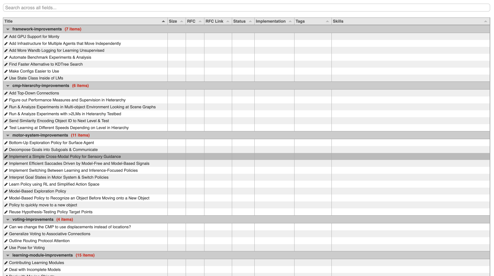
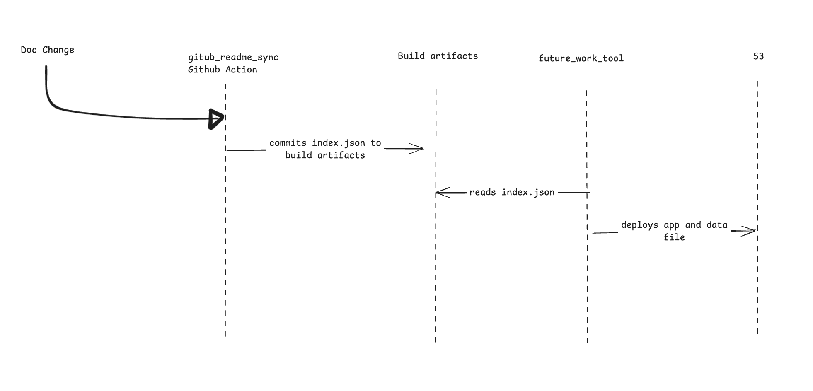
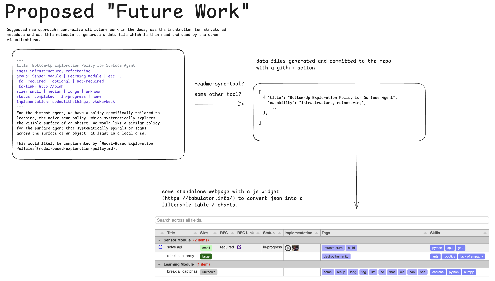
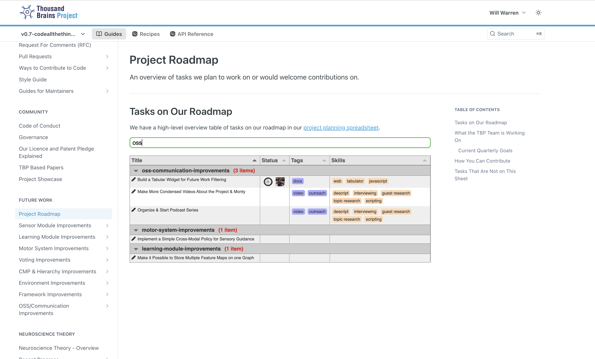

- Start Date: 2025-08-14
- RFC PR: https://github.com/thousandbrainsproject/tbp.monty/pull/428

# Summary

This RFC proposes to create a centralized process to update the future work artifacts.

# Motivation

Currently, there are three places to update the future work. 
- The markdown files in `docs/future-work` which holds the detailed descriptions of the work being suggested.
- The Google sheet where tasks are broken up by tag and type, as well as indicating who is currently working on a task.
- Our internal task tracking system, Shortcut.

There are some downsides to this:
- Updating 3 places when work is started, and maintaining those places as the work progresses.
- There is currently no way to move from viewing the spreadsheet back to the detailed descriptions of that work.
- It's cumbersome to add new structured data and have it be useful to the community.
- It is not possible to filter the tasks by different aspects. The only grouping we currently have is which Monty component a task relates to (columns in the sheet + sections in the docs). But it would be useful to also be able to filter by skills required, scope, output type, etc...

There are some upsides to the approach we propose in this RFC:

- We would like the community to more easily find work to contribute to based on their skills, desire and available time. The skills and scope data doesn't currently exist and adding it to a single place would be preferable.
- Having a central place to create and manage the future work should reduce the friction of adding new types of work or enriching existing documents.

Please note: there is manual maintenance work to keep these three places in sync, and there is also work to keep track of who is working on what and which work is complete - this RFC will not remove all of that manual work but does intend to reduce and centralize two of those places.

# Guide-level explanation

New types of front-matter are suggested along side the existing `title` key.
Specifically targeted for the future work section.

## New Front-Matter Values


|                key|values|
|------------------:|:-----|
| `improved-metric` | `infrastructure`, `refactoring`|
| `estimated-scope` | `small` &#124; `medium` &#124; `large` &#124; `unknown`|
| `rfc`             | `required` &#124; `optional` &#124; `not-required`  &#124; `URL to RFC`|
| `skills`          | `GPU`, `python`, `etc...`|
| `output-type`     | `Code PR` &#124; `Documentation PR` &#124; `Publication` &#124; `Experimental results` &#124; `Video` &#124; `Blog post` |

And these values after that work has begun:

|                    key|values|
|----------------------:|:-----|
| `status`              | `completed` &#124; `in-progress` |
| `contributor`         | `codeallthethingz`, `vkakerbeck`|


These structured pieces of data are extracted to a central file for downstream visualizations and consumers.

Of note, a tabular representation of this data so that the community can interact with the future work data and find items that might be suitable for their skills / desires / time appetite.

The widget will read in the structured file mentioned above, and give the user an interface to allow them to sort and filter the future work.

A mock-up of what that table may look like:



# Reference-level explanation

As mentioned above, the front-matter of all the docs in the in the `/docs` folder will be extracted and put into a data file.

Additionally the raw markdown content will be added to a text attribute

```js
[
  {
    "title": "Extract Sensor Modules",
    "skills": ["python","gpu architecture"],
    "estimated-scope": "small",
    "status": "in-progress",
    "contributor": ["codeallthethingz","vkakerbeck"],
    "etc...."
    // Generated values
    "slug": "extract-sensor-modules", // for linking back to the docs
    "path1": "future-work", // will be used for filtering to a subset of the docs
    "path2": "motor-system-improvements", // will be used to group the table rows
    // "pathN"...
    "text": "full contents of the markdown file"
  }
]
```

A GitHub action will process the documentation markdown files to build the central data file.  A good potential fit is the current documentation parser `github-readme-sync` tool.

A subsequent GitHub action and tool will process that data file and check for validity and fail the build if the data is incorrect.  Notably some fields must have correct values, and some mechanism will be used to ensure validity.

A page in the documentation will describe all the allowable fields for tags / skills / etc...

This tool or the action that uses it, will also be responsible for deploying the widget and data to an S3 bucket for web access.

## Sequence Diagram


## Filterable Table Widget

In the scope of this RFC is the future work filterable widget. This widget will allow community members to find work that matches their skills and scope appetite.

A quick review of the open-source table solutions led us to Tabulator (https://tabulator.info/) Tabulator has a set of features that cover our use-case, and an MIT license. The screenshot below is a mock-up using this library.


Requirements
- Global filter by the text of any cell in the table.
- Grouped by the large sections of work. (`path2` segment in the data.json file)
- Sort by any column
- Initially order the table by `group` and then within the group, by `title`
- Show who is working on this current work item using their GitHub avatar.
- Clickable tags that add / remove the value from search.
- Ability to show columns based on URL query parameters.
- Click through to the detail page in the docs.
- A way to go to the edit page for that doc on GitHub.

Nice To Haves (will implement if there is time after the requirements are met)
- Structured filtering. Filtering will work with simple text matches, so a search for 'large' will find both the rows with the estimated-scope tag 'large' and titles with 'large' in them as well as matches like largest and larger.
- Have a way of gathering statistics of the queries executed against the table as a way to understand what sorts of things the community is looking for.

Not requirements (but feel free to tell me if you think these are required)
- Persisting the state of the table.  For example, collapsing a group won't be remembered through page reloads.
- The full text of the future work document will not be included, and therefore not available for search or display within the widget.


General overview:



This widget can then be displayed using an iFrame within our docs / main website.




## Chaos Mitigation

Some strategies to mitigate the chaos of unstructured text fields
- Create documentation that describes the allowed values and what they're used for.
- Automatically generate part of that documentation page from the values found in the future work front matter sections not as a complete list, but as a reference.
- Have the tool that generates the central data file, also do sanity checking on the data and fail the build for invalid values.
- Cap the number of tags / skills a document can contain and fail the build if it goes over that max. Ten skill and ten tags should be enough.

## Optional Nice to Have Tasks

- Put the structured front-matter into the future-work/subpage documents so you can see who's working on them, the estimated scope, without having to go to the table widget.
- Link to the table widget from each future work sub-page.

# Drawbacks

Having free form text powering downstream applications that require structured information has some downsides:
- It requires human oversight to make sure the values are uniform and don't become chaotic.
- Getting humans to adopt a structured process requires training and increases cognitive load.

# Rationale and alternatives

We could instead, tie into a structured SaaS platform.  Our internal Shortcut tool could be a possibility here as it potentially allows for structured tags and centralizes all work into a single place.  However, there would be considerable synchronization required. I have not looked into this idea extensively.

# (Un)resolved questions

Q: Where should we host the widget?  It's a simple HTML page that makes a fetch to the raw data file on GitHub. It could be added to our website, thousandbrains.org as a custom HTML page. It could be stored and served from a S3 bucket.
A: S3 Bucket.

Q: Should we auto-deploy the table widget? We could create a GitHub action to deploy the tabular visualization widget to its destination. However, it will be pretty rare to deploy this once the initial development is complete and require new types of access from the GitHub action to our infrastructure.
A: Yes.
